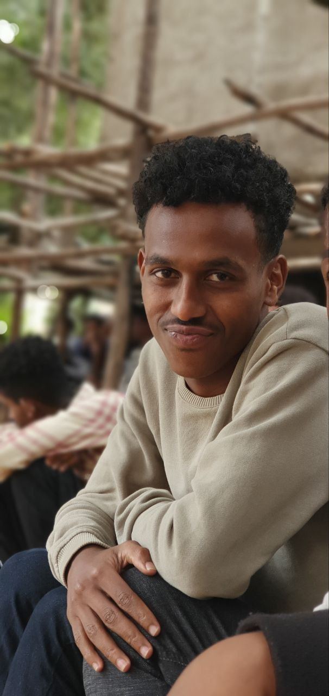

# yonas-repo
description
<!DOCTYPE html>
<html lang="en">
<head>
    <meta charset="UTF-8">
    <meta name="viewport" content="width=device-width, initial-scale=1.0">
    <title>Yonas Getahun | Full-Stack Web Architect</title>

    <link href="https://cdn.jsdelivr.net/npm/bootstrap@5.3.0/dist/css/bootstrap.min.css" rel="stylesheet">

    <link href="https://fonts.googleapis.com/css2?family=Inter:wght@300;400;700;900&display=swap" rel="stylesheet">

    <link rel="stylesheet" href="https://cdnjs.cloudflare.com/ajax/libs/font-awesome/6.5.1/css/all.min.css">

    
</head>
<body>

<nav class="navbar navbar-expand-lg fixed-top">
    

        <a class="navbar-brand text-white fw-bold" href="#">YONAS GETAHUN.</a>
        <button class="navbar-toggler" type="button" data-bs-toggle="collapse" data-bs-target="#navbarNav">
            
        </button>
        

            

                <a class="nav-link d-inline-block" href="#home">HOME</a>
                <a class="nav-link d-inline-block" href="#about">ABOUT</a>
                <a class="nav-link d-inline-block" href="#work">PROJECTS</a>
                <a class="nav-link d-inline-block" href="#contact">CONTACT</a>
            

        

    

</nav>

<section id="home" class="hero">
    

        

            

                <h1>YONAS GETAHUN</h1>
                <h4 class="text-blue mb-4">Full-Stack Web Architect</h4>
                

                    Building high-performance digital systems and scalable web solutions with modern engineering standards.
                

                <a href="#work" class="btn btn-blue mt-4">VIEW MY PROJECTS</a>
            

            

                

                    
                

            

        

    

</section>

<section id="about" class="section-padding">
    

        <h2 class="text-center text-blue fw-bold mb-5">About</h2>
        

            

                <h2>I AM YONAS</h2>
                

                    I am <b>Yonas Getahun</b>, a Full-Stack Developer passionate about scalable and elegant web applications.
                

                
I build secure, fast, and future-ready systems using the latest industry standards. My focus is on turning complex requirements into seamless user experiences.

            

            

                

                    <h4 class="text-center mb-4">TECHNICAL STACK</h4>
                    

                        
Frontend (React/Next.js)95%

                        

                    

                    

                        
Backend (Node/Python)88%

                        

                    

                    

                        
Cloud & DB (AWS/PostgreSQL)82%

                        

                    

                

            

        

    

</section>

<section id="work" class="section-padding">
    

        <h2 class="text-center fw-bold mb-5">WEB SOLUTIONS</h2>
        

            

                

                    
                    

                        <h5 class="text-blue">Data Intelligence Platform</h5>
                        
A sophisticated dashboard for real-time data visualization and predictive analytics using React and D3.js.

                        <a href="#" class="text-blue text-decoration-none fw-bold">View Case Study <i class="fas fa-arrow-right ms-1"></i></a>
                    

                

            

            

                

                    
                    

                        <h5 class="text-blue">FinTech Core System</h5>
                        
High-security banking infrastructure built with Node.js microservices and encrypted database architectures.

                        <a href="#" class="text-blue text-decoration-none fw-bold">View Case Study <i class="fas fa-arrow-right ms-1"></i></a>
                    

                

            

            

                

                    
                    

                        <h5 class="text-blue">E-Commerce Ecosystem</h5>
                        
Scalable online retail solution featuring dynamic inventory management and seamless payment gateway integration.

                        <a href="#" class="text-blue text-decoration-none fw-bold">View Case Study <i class="fas fa-arrow-right ms-1"></i></a>
                    

                

            

        

    

</section>

<section id="contact" class="section-padding">
    

        

            

                

                    <small class="contact-subtitle">LET’S CONNECT</small>
                    <h2 class="contact-title">Get In Touch</h2>
                    

                    <ul class="contact-info">
                        <li><i class="fas fa-envelope"></i>yonasget320@gmail.com</li>
                        <li><i class="fas fa-phone"></i>0946019597</li>
                        <li>
                            <i class="fab fa-linkedin-in"></i>
                            <a href="https://linkedin.com/in/yourusername" target="_blank">LinkedIn Profile</a>
                        </li>
                        <li>
                            <i class="fab fa-github"></i>
                            <a href="https://github.com/yonasget320-pixel" target="_blank">GitHub Profile</a>
                        </li>
                    </ul>
                

            

            

                

                    <small class="contact-subtitle">SEND A MESSAGE</small>
                    <h2 class="contact-title">Let’s Talk</h2>
                    

                    <form>
                        <input type="text" class="form-control mb-3" placeholder="Your Name" required>
                        <input type="email" class="form-control mb-3" placeholder="Your Email" required>
                        <textarea class="form-control mb-4" rows="5" placeholder="Your Message" required></textarea>
                        <button type="submit" class="btn btn-blue w-100">Send Message</button>
                    </form>
                

            

        

    

</section>

<footer>
    

        
© 2025 Yonas Getahun — Full-Stack Architect

    

</footer>

</body>
</html>
